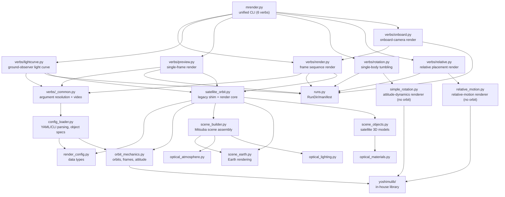

# Physically Based Satellite Orbit Rendering - Advanced Optical Simulator

[日本語版 README](README.md) | English

A project that renders artificial satellites with physical accuracy from Keplerian orbital elements using Mitsuba 3.

## Main features

✨ **New - advanced optical simulation!**

### Core features

- **Physically based orbit computation**: accurate position and velocity from Keplerian orbital elements
- **Real physical parameters**: Earth radius 6371 km, real orbital altitudes (e.g. ISS: 408 km)
- **Attitude control modes**:
  - NADIR pointing (toward the Earth center)
  - Sun tracking (solar panels face the Sun)
  - Velocity aligned (aligned with the direction of travel)
- **Realistic satellite 3D model**: detailed model with bus, solar panels and antenna
- **Multiple view modes**:
  - Inertial overview (`inertial`, looking at the satellite and Earth from outside)
  - Onboard camera (looking down at Earth)
- **Physically based rendering**: photorealistic lighting with Mitsuba 3

### Advanced optics 🔬

- **Real spacecraft materials**: optical properties of aluminium, gold plating, solar cells, MLI insulation and more
- **Physically based sunlight**: accurate solar spectrum from the color temperature (5778 K)
- **Starfield ambient light**: realistic space background (adjustable brightness)
- **Atmospheric scattering module**: Rayleigh and Mie scattering of the Earth atmosphere (implemented)
- **Earth albedo effect**: light reflected from Earth (earthshine) (implemented)

## Setup

### Distribution setup (students / external researchers)

Steps for people invited as collaborators to the private GitHub repository.

```bash
git clone https://github.com/yyoshimula/mRendering.git
cd mRendering
python3 -m venv venv && source venv/bin/activate
pip install -r requirements.txt
python mrender.py gui                 # opens http://127.0.0.1:8600
```

- **Python 3.11 or newer** is required (developed on 3.11). The CPU build of Mitsuba
  from pip (`llvm_ad_rgb`) runs every feature. Verified on Apple Silicon Macs.
- **`assets/starfield.exr` (287 MB) is not in the clone.** It exceeds GitHub's 100 MB
  limit, so it is not tracked by Git; `tools/generate_starfield.py` generates it from the
  HYG catalog on first start (about 3 s, always identical). The projection convention is
  recorded in `assets/starfield.exr.json`; an EXR with an outdated convention or without
  the sidecar is regenerated automatically at startup. **The projection convention changed
  on 2026-09-08** (the old EXR was mirrored with respect to the Mitsuba envmap), so
  environments with an older EXR (e.g. DGX) regenerate once on first start. To rebuild manually:
  `python tools/generate_starfield.py --width 8192 --milky-way --output assets/starfield.exr`
- **NASA Blue Marble 500 m/px tiles** are optional. Fetch them with
  `python tools/prepare_bmng.py` only if you want a high-resolution Earth background
  (the default texture works without them).
- **Blender is not required.** It is used only to convert Draco-compressed GLB files on first load.
- **The AI drawer** ("🤖 AI" in the GUI header) is enabled automatically when the `claude`
  CLI is installed locally. Without it the button simply does not appear.
- **`gui_hosts.json`** (remote execution machines) is not tracked by Git. If needed,
  `cp gui_hosts.example.json gui_hosts.json` and edit it.
- **`internal/` holds lab-only data** (models from collaborations and real-observation
  validation) and is not on GitHub. Every feature works without it.
- Lab members who want to run on the GPU (DGX Spark): see [tools/dgx/README.md](tools/dgx/README.md).

### 1. Create and activate a virtual environment

```bash
python3 -m venv venv
source venv/bin/activate
```

### 2. Install dependencies

```bash
pip install -r requirements.txt
```

## Display language (Japanese / English)

The GUI and the CLI help follow the system language. Anything other than Japanese is shown in English.

- **GUI**: detected from the browser language (`navigator.language`). Override with the
  "Language" selector in the header (auto / 日本語 / English), which is remembered in the
  browser, or with `?lang=en` / `?lang=ja` in the URL.
- **CLI help** (`python mrender.py <verb> --help`): detected from the locale
  (`LC_ALL` > `LC_MESSAGES` > `LANG`). Force a language with `MRENDER_LANG=en` or `MRENDER_LANG=ja`.
- The source strings are Japanese; the English text comes from dictionaries
  (`gui/i18n.js`, `cli_i18n.py`). Log output and exception messages are not translated.

## GUI (browser)

Every verb can be driven from the browser without touching the CLI. No Flask or other
framework is needed (standard library only).

```bash
source venv/bin/activate
python mrender.py gui                        # opens http://127.0.0.1:8600 automatically
python mrender.py gui --port 8765 --no-browser   # change the port / do not open a browser
```

### Launch as an app (macOS, double-click)

```bash
bash packaging/build_app.sh    # → builds dist/mRender.app (a lightweight launcher of a few hundred KB)
```

Double-clicking `dist/mRender.app` (copying it to `/Applications` is fine) starts the GUI
server in the background and opens it in the app mode of Chrome/Edge/Brave (a tab-less,
app-like window). If the server is already running it only opens the window (no double
start). Unlike SatCap.app, Python is not bundled: **the venv of this repository is used**,
so rebuild the app after moving the repository.

- Log: `runs/_gui_configs/gui_server.log`
- Stop the server: `lsof -ti:8600 | xargs kill`
- Regenerate the icon: `venv/bin/python packaging/make_icon.py` (renders the satellite model)

What the GUI offers:

- **Scenario → target → preset → tweak**: choose "Absolute orbit / Relative orbit /
  Ground observation" at the top, pick the target and its preset loads automatically.
  Switching tabs back and forth restores the values being edited and the open sections.
  In Relative orbit, chief and deputy are selected individually and the chief is fixed at
  the Hill origin [0,0,0] km. With `relative_frame: hill` (default) the relative position is
  in Hill/RTN components, independent of the chief attitude. Use `relative_frame: chief`
  for legacy position data in the chief body frame.
  The camera can be chief→deputy, chief fixed, deputy→chief, deputy fixed, or external/manual.
  "fixed" keeps a line of sight that follows the host attitude; tracking looks at the other
  spacecraft's center every frame. `camera_offset` / `camera_direction` / `camera_body_up`
  are given in the host body frame. In the onboard camera the host model is hidden.
  "Model viewer" is a dedicated mode that shows OBJ/PLY/GLB/glTF directly in the browser
  (Three.js is bundled, no CDN needed). It uses neither Mitsuba nor a remote worker: after
  loading, mouse interaction and display switching stay inside the browser.
  Selecting a model fits it to the view; drag to rotate, wheel to zoom. The axes sit at the
  model center and keep the original model's axis directions.
  Solid, solid + wireframe and wireframe-only modes are available. Materials are a
  real-time approximation and differ from the physically based render.
  With "Use model materials" ON, registered models such as Hubble get the per-part materials
  of their preset (OFF shows a uniform grey for shape checking).
  The wireframe shows the triangle-mesh edges; "wireframe only" also shows back edges.
  The model viewer reads Draco-compressed GLB directly with the bundled decoder. The first
  conversion of a Draco GLB for regular Mitsuba rendering needs Blender (found on PATH or at
  the standard macOS install location). Converted OBJ files are reused; a broken OBJ with all
  vertices collapsed is regenerated from the GLB. All classic verbs are available under
  "Other run modes".
- **Settings on the left, live preview on the right**: the live preview is ON at startup.
  View and video creation are changed at the top; detailed settings (orbit, materials,
  telescope, ...) stay in collapsible sections. Selecting a regular preset replaces the
  settings; the Earth-background overlay preset is applied on top.
- **Save preset**: YAML saved from the GUI carries scenario/target information in a comment
  and appears under the same category after a restart. YAML without a category is available
  under "Custom".
- **Start rendering** (jobs write YAML to `runs/_gui_configs/` and run as a subprocess;
  progress, the latest frame, past runs and video links are shown in the GUI)
- **Show YAML / Save preset**: save the form contents as-is to `presets/*.yaml`
- **Live preview** (stop with "Live preview OFF" in the right column): a viewport in the
  style of Blender's render preview. Form changes re-render immediately (~0.3 s), and the
  image refines to full resolution when idle.
  - Left drag = orbit / wheel = dolly / Shift+drag = pan
    (written back to the camera_origin/target fields)
  - Timeline slider scrubs tumble/csv attitude; Sun azimuth/elevation sliders
  - The refined image matches the production output pixel for pixel (bit-exact for the render verbs)
  - During interaction a simplified rendering (~0.1-0.2 s) is used automatically; normal quality returns on release
- **Machine selector** ("Machine" at the top right, next to the AI button): run jobs and the
  live preview on local or on a remote GPU (e.g. DGX Spark). Remote machines are defined in
  `gui_hosts.json`; results are mirrored to `runs/` automatically. **Sync code and assets
  beforehand with `tools/dgx/sync_to_dgx.sh`** (re-sync after adding models or presets).
  Details: [tools/dgx/README.md](tools/dgx/README.md)
- **AI assistant** ("🤖 AI" in the header): a chat drawer that relays the local `claude` /
  `cursor-agent` CLI. Preset edits requested there are reflected in the GUI automatically
- **High-resolution Earth background (relative verb)**: turn on `earth_gibs` in the
  "Space environment" section to fetch only the visible area of NASA GIBS daily imagery
  (with clouds, needs network) as the background. Even when OFF, the visible-area crop from
  the BMNG 500 m/px tiles (`assets/textures/earth_day_500m/`; generate with
  `tools/prepare_bmng.py` if absent) is used by default

### Additional model library

The model lists for the model viewer, chief and deputy also include the extra models in
`models/library/`. ACS3, BlueWalker-3, EKRAN and the H-IIA upper stage (ADRAS-J) are included.
Non-public models (from collaborations) live in `internal/` and are distributed only within the lab.
See [models/library/README.md](models/library/README.md) for materials, textures, units and re-import steps.
Generated OBJ files and textures are not tracked by Git; regenerate or sync assets on another machine.

## Usage (CLI)

The unified CLI is `mrender.py` with the following subcommands (verbs).
All settings are given through YAML presets (`--config`).


| Verb         | Purpose                                                                                          | Main output                  |
| ------------ | ------------------------------------------------------------------------------------------------ | ---------------------------- |
| `render`     | Frame sequence from orbital dynamics (for video)                                                 | `frames/frame_*.png`         |
| `lightcurve` | Ground-observer light curve of the primary object as CSV                                         | `light_curve.csv`            |
| `preview`    | Render a single frame immediately (for material/lighting tuning)                                 | `frames/frame_<start>.png`   |
| `rotation`   | No orbit; Euler rotational motion of a single body (tumbling)                                    | `frames/frame_*.png`         |
| `relative`   | No orbit; two spacecraft from relative position and attitude only                                | `frames/frame_*.png`         |
| `onboard`    | Alias of `render` for the onboard camera (`view_mode=satellite` by default, one spacecraft looks at another) | `frames/frame_*.png` |
| `groundobs`  | Optical observation from a ground telescope (apparent-magnitude light curve + sensor image, TLE/SGP4) | `observation.csv`, `frames/` |
| `gui`        | Browser GUI for all of the above (see [GUI (browser)](#gui-browser))                              | —                            |


```bash
source venv/bin/activate

# full video render
python mrender.py render --config presets/iss.yaml

# quick light curve only, as seen by an observer
python mrender.py lightcurve --config presets/iss.yaml

# a single frame for material / lighting tuning
python mrender.py preview --config presets/iss.yaml

# combine presets (later files take precedence)
python mrender.py render --config presets/iss.yaml presets/earth_beauty.yaml

# render orbit and attitude read from a CSV file
python mrender.py render --config presets/csv_attitude_orbit.yaml

# single-body tumbling (no orbit, attitude dynamics only)
python mrender.py rotation --config presets/rotation_hubble.yaml
python mrender.py rotation --frames 30 --wx 0.3 --wy 0.1 --wz 1.5

# two spacecraft in relative placement (no orbit, relative position + attitude)
python mrender.py relative --config presets/relative_static.yaml
python mrender.py relative --mode tumble --rel-position 1.5 0 0 --wz 1.0
python mrender.py relative --mode csv --rel-csv input/rel_state_sample.csv

# two spacecraft in orbit (CSV-driven) — deputy looks at chief
python mrender.py onboard --config presets/relative_view.yaml

# optical observation from a ground telescope (magnitude light curve + sensor image; TLE supported)
python mrender.py groundobs --config presets/groundobs_hubble.yaml
```

### Typical use cases (aligned on CSV input)


| Case                                   | Verb                    | Preset                            | Input CSV                                              | Summary                                                                                      |
| -------------------------------------- | ----------------------- | --------------------------------- | ------------------------------------------------------ | -------------------------------------------------------------------------------------------- |
| **A** Orbit from the inertial frame    | `render`                | `presets/csv_attitude_orbit.yaml` | `input/attitudeOrbit.csv`                              | Load one absolute orbit (osculating 6 elements + optional attitude) and render from outside   |
| **B** Two in orbit, one looks at the other | `onboard` (or `render`) | `presets/relative_view.yaml`   | `input/abs_chief_hcw.csv` + `input/abs_deputy_hcw.csv` | Load two absolute orbits; `view_camera_name` / `view_target_name` make an onboard camera look at the other object |
| **C** Relative placement without orbit | `relative`              | `presets/relative_static.yaml`    | `input/rel_state_hcw.csv`                              | Pin chief at the origin and place deputy from a time series of relative position/attitude (no orbital dynamics) |


`presets/iss.yaml` uses no CSV input; it is a sample preset for checking the ISS orbit from an
inertial overview. It enables `camera.view_mode: inertial`, the orbit trail and the inertial
axes, so it is suited to seeing the orbit shape and satellite motion in inertial space rather
than from an Earth-fixed view.

### Orbit-free modes (`rotation` / `relative`)

Lightweight modes that render from user-supplied attitude/position without Earth or orbital
dynamics. Handy for checking materials and lighting in isolation or for relative-motion demos.

- `rotation` — `simple_rotation.py` as a verb. Given an inertia tensor and initial angular
  velocity, the attitude is propagated with Euler's rotation equations `I·ω̇ = -ω×(I·ω)`.
- `relative` — `relative_motion.py` as a verb. The chief is pinned at the origin with identity
  attitude; the deputy is placed with a relative position `r_rel` and a relative attitude
  quaternion `q_rel`. Three input modes:
  - `static`: a single `(r_rel, q_rel)` for every frame
  - `csv`: interpolate a time series CSV `time_s, x, y, z, qx, qy, qz, qw`
  - `tumble`: chief static + deputy under Euler rotation (fixed position, only the attitude moves)

Sample presets: `presets/relative_static.yaml`, `presets/relative_tumble.yaml`.
Per-frame time series of solar-panel irradiance (direct / earthshine / other [W/m²]) and
generated power [W] can be measured in relative (including absolute mode) and groundobs
(`pv_panels:` / `--pv-panel-size` write `pv_irradiance.csv`; example
`presets/pv_hubble_orbit.yaml`, analytic reference `tools/pv_earthshine_reference.py`.
groundobs can add Earth's reflected light to the observation image with `--earthshine`.
Besides a uniform-albedo sphere, `--earth-albedo-gibs` maps a two-layer albedo map
(`earth_albedo_map.py`) built from MODIS cloud fraction and optical thickness (NASA GIBS)
plus surface albedo. See the PV section of CLAUDE.md for details).
Sample CSV: `input/rel_state_sample.csv`.

`relative` has photoreal environment options (Earth background, blackbody Sun color,
starfield envmap, onboard camera view) and suits OOS proximity imaging (e.g.
`presets/oos_hubble.yaml`). By default the Earth background **crops only the visible area
from a high-resolution source** (BMNG 500 m/px tiles = `assets/textures/earth_day_500m/`,
generated with `tools/prepare_bmng.py` if absent; `earth_gibs: true` switches to NASA GIBS
daily imagery. Attribution required: NASA GIBS). See the relative-options section of CLAUDE.md.

### Per-run output directory

Every run creates `runs/<YYYYMMDD_HHMMSS>_<verb>_<name>/` containing:

```
runs/20260425_153000_render_iss/
├── frames/                 # frame images (render / preview)
├── light_curve.csv         # light curve (lightcurve / legacy sim)
├── config.resolved.yaml    # snapshot of the resolved arguments (for reproduction)
└── manifest.json           # verb, argv, git rev, start/end time, status, etc.
```

If `output_dir` is given explicitly in YAML/CLI it is used; otherwise a `runs/...` directory
is created automatically. `runs/` is not tracked by git (already in `.gitignore`).

### Backward compatibility: `satellite_orbit.py`

The legacy entry point still works (it dispatches to the `mrender` verbs internally):

```bash
# legacy form — automatically the render verb
python satellite_orbit.py --config presets/iss.yaml

# legacy + light curve — frames + lightcurve into the same run dir
python satellite_orbit.py --config presets/iss.yaml  # light_curve: true in the YAML

# light curve only (no_frames: true, light_curve: true in the YAML)
python satellite_orbit.py --config presets/iss.yaml
```

The only behavioral difference is the output location: old `output/` → new `runs/<ts>_render_<name>/frames/`.

### Writing YAML presets

See also the samples in `presets/`. Below is the **reference of every key available to the
`render` / `lightcurve` / `preview` / `onboard` family** (the orbit-free `rotation` /
`relative` verbs use a separate scheme — see each verb's `--help`).

Section names (`primary`, `rendering`, `camera`, ...) are organizational; the inner keys are
flattened and normalized to argparse dest names. Precedence: **CLI arguments > YAML >
`_ARG_DEFAULTS`**. When several YAML files are stacked with `--config A.yaml B.yaml`,
**later files win**.

```yaml
# ===========================================================================
# primary: orbit, attitude and model of the primary object (one satellite)
# ===========================================================================
primary:
  name: iss                       # object name (also the prefix in the scene dict)
  orbit:                          # primary.orbit.* is expanded to the top level
    altitude: 408.0               #   altitude [km] (a = R_earth + altitude)
    eccentricity: 0.0             #   eccentricity [-]
    inclination: 51.6             #   inclination [deg]
    raan: 0.0                     #   right ascension of the ascending node [deg]
    arg_periapsis: 0.0            #   argument of periapsis [deg]
    mean_anomaly: 0.0             #   mean anomaly [deg] (initial phase at t=0)
  attitude_mode: nadir            # 'nadir' / 'sun_tracking' / 'velocity_aligned'
  scale: 0.002                    # scene-unit scale (Earth radius = 1.0)
  model:                          # external 3D model (OBJ/PLY/GLB)
    path: null                    #   file path (null = procedural satellite)
    material: null                #   BSDF name ('aluminum_brushed' / 'gold' / 'solar_panel' ...)
    keep_materials: false         #   true keeps the OBJ's MTL as-is
  csv_path: null                  # absolute-orbit CSV (overrides Kepler propagation)
  propagator: kepler              # 'kepler' (analytic) / 'numerical' (J2/drag)
  use_j2: false                   # enable J2 perturbation for numerical
  use_drag: false                 # enable atmospheric drag for numerical
  drag_cd: 2.2                    # drag coefficient Cd
  drag_a_over_m: 0.01             # area-to-mass ratio [m²/kg]
  orbit_speed: 1.0                # orbit playback factor (1.0 = real time)

# ===========================================================================
# objects: additional objects (optional, any number). Same schema as primary
# ===========================================================================
objects:
  - name: relay
    orbit:
      altitude: 600
      inclination: 97.8
    attitude_mode: sun_tracking
    scale: 0.002
    model_path: null              # path / material / keep_materials also allowed
    model_material: null
    csv_path: null                # per-object CSV (Case B)

# ===========================================================================
# rendering: resolution, frame count, sampling, output location, video
# ===========================================================================
rendering:
  frames: 60                      # total number of frames
  start_frame: 0                  # start of a partial render (for batch runs)
  end_frame: null                 # end of a partial render (null = up to frames)
  width: 1920                     # image width [px]
  height: 1080                    # image height [px]
  samples: 128                    # spp (path-tracing samples per pixel)
  output_dir: null                # output location; null auto-creates runs/<ts>_<verb>_<name>/
  no_frames: false                # true skips frame output (when only the light curve is wanted)
  make_video: false               # encode an mp4 with ffmpeg when done
  video_fps: 30.0                 # mp4 frame rate
  video_name: output.mp4          # mp4 file name (in the run dir)

# ===========================================================================
# animation: sampling of the simulation time
# ===========================================================================
animation:
  duration_sec: null              # total simulated time [s]; null spreads the CSV span or orbit period evenly over frames
  fps: null                       # used only with duration_sec; if set dt = 1/fps, otherwise dt = duration_sec / frames
  start_time: 0.0                 # simulation start time [s] (CSV reference start)

# ===========================================================================
# camera: view mode, chase distances, manual overrides
# ===========================================================================
camera:
  view_mode: inertial             # 'inertial' / 'chase' / 'satellite' / 'earth'
  inertial_fixed: true            # inertial: fixed in the inertial frame (false follows the object)
  inertial_distance: 2.5          # inertial: distance from the Earth center (scene units)
  chase_back: 0.15                # chase: offset behind (scene units)
  chase_out: 0.1                  # chase: offset along the normal (scene units)
  origin: null                    # manual camera position [x,y,z] (scene units)
  target: null                    # manual look-at point [x,y,z] (scene units)
  fov: null                       # field of view [deg]
  up: null                        # up vector [x,y,z]
  target_lat: null                # look-at latitude [deg]
  target_lon: null                # look-at longitude [deg]
  target_alt: 0.0                 # look-at altitude [km]
  view_camera_name: null          # satellite view: name of the object carrying the camera
  view_target_name: null          # satellite view: name of the object to look at

# ===========================================================================
# earth: Earth texture, clouds, night lights, atmosphere, rotation
# ===========================================================================
earth:
  day_texture: assets/textures/earth_day.jpg  # day-side texture (equirectangular recommended)
  night_texture: null             # night-lights texture (e.g. BlackMarble)
  cloud_texture: null             # cloud texture
  use_night_lights: false         # draw the night-lights layer
  use_clouds: false               # draw the cloud layer
  cloud_opacity: 0.5              # cloud opacity [0..1]
  night_mask_res: 1024            # night mask resolution [px]
  night_terminator_softness: 0.02 # smoothstep width of the day/night terminator
  use_atmosphere: false           # add an atmosphere shell
  atmosphere_density: 0.02        # atmospheric scattering coefficient scale
  atmosphere_radius_scale: 1.03   # atmosphere radius (1.0 = surface)
  earth_only: false               # true renders Earth only (hides satellites etc.)
  earth_rotation: true            # enable Earth rotation
  earth_rotation_period_hours: 23.934  # rotation period [h] (sidereal day)
  earth_rotation_speed: 1.0       # rotation speed factor (debugging)

# ===========================================================================
# lighting: Sun, starfield, HDRI, orbit trail, tone mapping
# ===========================================================================
lighting:
  advanced_optics: false          # blackbody Sun + starfield envmap
  sun_temperature: 5778.0         # effective temperature of the Sun [K]
  sun_angle: null                 # ecliptic longitude of the Sun [deg] (0 = vernal equinox); null = auto
  epoch_utc: null                 # ISO 8601 UTC; when set, Sun = VSOP87 and rotation = GMST at real time
  sun_rotate: false               # rotate the Sun direction over time
  sun_rotate_period: 60.0         # Sun rotation period [s]
  sun_rotate_speed: 1.0           # Sun rotation speed factor
  starfield_brightness: 0.01      # starfield envmap scale
  hdri_path: null                 # HDRI environment map path (null = starfield or black)
  show_orbit: false               # draw the trajectory line (render verb only)
  orbit_line_radius: 0.005        # trajectory cylinder radius (scene units)
  orbit_line_color: [0.2, 0.6, 1.0]  # trajectory RGB color [0..1]
  orbit_line_glow: 0.5            # trajectory emission factor (0 = no emission)
  exposure: 0.0                   # exposure compensation [stops] (+1 doubles brightness)
  gamma: 2.2                      # gamma (sRGB approximation)

# ===========================================================================
# observer: ground observer for the light curve (lightcurve verb / light_curve=true)
# ===========================================================================
observer:
  light_curve: false              # write the light-curve CSV
  light_curve_fov: 2.0            # observer field of view [deg]
  light_curve_samples: 64         # spp per light-curve sample
  observer_lat: 35.0              # observer latitude [deg]
  observer_lon: 135.0             # observer longitude [deg]
  observer_alt: 0.0               # observer altitude [km]
```

**Notes**:

- `_ARG_DEFAULTS` in `[config_loader.py](config_loader.py)` (from line 188) is the single
  source of truth for all keys and defaults. Add new keys there too
- Section names are organizational; only `primary` / `camera` / `earth` are remapped by
  dedicated merge functions (e.g. `camera.fov` → `camera_fov`, `primary.model.path` →
  `satellite_model`). The others (`rendering`, `lighting`, `animation`, `observer`) are
  simply flattened, so inner key names must match the dest names in `_ARG_DEFAULTS`
- The `rotation` / `relative` verbs use **a different argument scheme from this reference**
  (see the argparse definitions used by `simple_rotation.py` / `relative_motion.py`, or start
  from `presets/rotation_hubble.yaml` / `presets/relative_full.yaml`)

## Output

Every run creates a new run directory (see [Per-run output directory](#per-run-output-directory)):

```
runs/20260425_153000_render_iss/
  ├── frames/
  │   ├── frame_0000.png
  │   ├── frame_0001.png
  │   └── ...
  ├── light_curve.csv          # only for the lightcurve verb / --light-curve
  ├── config.resolved.yaml
  └── manifest.json
```

`manifest.json` records `verb`, `argv`, the resolved arguments, the git revision, start/end
times and status, so any past run can be reproduced exactly.

## Scene composition

### Earth model

- Radius: 6371 km (real Earth radius)
- Material: diffuse
- Texture: optional image mapping
- Optional extra layers:
  - Night lights (emission masked to the night side)
  - Cloud layer (thin white diffuse)
  - Simple atmosphere shell (thin scattering medium)

### Satellite model (detailed 3D model)

- **Bus**: aluminium box (about 1.5×1.5×2.0 m)
- **Solar panels**: two wings (about 5×3 m), dark blue
- **Antenna**: gold-plated cylinder

### Lighting

- **Sunlight**: directional light whose position changes with time
- **Ambient**: dark space background (starfield)

## Making animation videos

### Automatic (recommended)

With `make_video: true` in YAML / CLI, `render` / `relative` / `onboard` produce
`runs/<ts>_<verb>_<name>/output.mp4` after rendering (ffmpeg required).

```yaml
rendering:
  frames: 60
  make_video: true       # without ffmpeg only a warning is printed and the step is skipped
  video_fps: 30          # playback frame rate of the mp4; independent of the simulation time step
  video_name: output.mp4 # output file name (in the run dir)
```

### Manual

Build it from the image sequence yourself (ffmpeg required):

```bash
RUN=runs/20260425_153000_render_iss   # pick the run

# 30 fps
ffmpeg -framerate 30 -i $RUN/frames/frame_%04d.png \
    -c:v libx264 -pix_fmt yuv420p $RUN/satellite_orbit.mp4

# 60 fps (smoother)
ffmpeg -framerate 60 -i $RUN/frames/frame_%04d.png \
    -c:v libx264 -pix_fmt yuv420p -crf 18 $RUN/satellite_orbit_hq.mp4
```

## Customization

Edit the modules to customize:

- Satellite shape and size (`create_satellite` in `scene_objects.py`)
- Earth material (`create_earth` in `scene_earth.py`)
- Rendering quality (`sample_count` in `satellite_orbit.py`)
- Camera field of view and position (`create_scene` in `scene_builder.py`)

## Troubleshooting

### Rendering is slow

Lower `rendering.samples` in the YAML, or check a single frame with `preview` first:

```bash
python mrender.py preview --config presets/iss.yaml
```

### High-resolution rendering

Set the resolution in YAML (recommended):

```yaml
rendering:
  width: 3840
  height: 2160
  frames: 30
  samples: 128
```

### Batch rendering

Split the work with `start_frame` / `end_frame` in YAML. Fixing `output_dir` to the same
path gathers several batches into one run:

```yaml
# presets/_batch_a.yaml
rendering:
  frames: 100
  start_frame: 0
  end_frame: 25
output_dir: runs/iss_long_run     # explicit path collects everything in one run dir
```

## Technical details

### Orbital mechanics

- **Orbit computation**: numerical solution of Kepler's equation (Newton's method)
- **Frame**: ECI (Earth-centered inertial)
- **Orbital elements**: full six elements (a, e, i, Ω, ω, M₀)
- **Orbital period**: from Kepler's third law

### Attitude control

- **NADIR pointing**: Z axis always toward the Earth center
- **Sun tracking**: Z axis follows the Sun direction
- **Velocity aligned**: X axis along the velocity

### Rendering

- **Engine**: Mitsuba 3
- **Variant**: scalar_rgb (CPU)
- **Method**: path tracing
- **Samples**: 128 spp (high quality)
- **Max depth**: 12 bounces

### Optical simulation

#### Material models (optical_materials.py)

- **Conductors**: aluminium, gold, silver, copper, titanium (complex refractive index)
- **Dielectrics**: glass, sapphire, Kapton, Teflon
- **Spacecraft materials**:
  - Bus: brushed aluminium (anisotropic reflection)
  - Solar cells: low-reflectance diffuse surface (dark bluish)
  - Antenna: gold plating (low-roughness conductor)
  - MLI insulation: gold film (mix of specular and diffuse)
- **BSDFs**: conductor, roughconductor, dielectric, roughdielectric, plastic, diffuse

#### Lighting models (optical_lighting.py)

- **Sunlight**: color temperature → RGB from blackbody theory (5778 K = daylight)
- **Magnitude system**: relative intensity from apparent magnitudes
- **Ambient**: starfield and earthshine models
- **Lighting presets**: daylight, sunset, eclipse, etc.

#### Atmospheric scattering (optical_atmosphere.py)

- **Rayleigh scattering**: λ^(-4) wavelength dependence; blue sky and sunsets
- **Mie scattering**: aerosol scattering with the Henyey-Greenstein phase function
- **Atmosphere model**: exponential density decay (scale height 8 km)
- **Optical depth**: attenuation by path integration
- **Earth albedo**: solid-angle computation of light reflected from Earth (earthshine)

## Module structure




```
mRendering/
├── mrender.py                  # unified CLI (render / lightcurve / preview / rotation / relative / onboard)
├── runs.py                     # RunDir + manifest management
├── verbs/                      # subcommand implementations
│   ├── _common.py              #   argument resolution, object specs, video (maybe_make_video)
│   ├── render.py               #   frame sequence render (with orbit)
│   ├── lightcurve.py           #   ground-observer light curve
│   ├── preview.py              #   single-frame render
│   ├── rotation.py             #   single-body tumbling (no orbit)
│   ├── relative.py             #   two spacecraft in relative placement (no orbit)
│   └── onboard.py              #   onboard camera looking at another object (thin alias of render)
├── satellite_orbit.py          # core of render/lightcurve/preview (render_frame etc.) + legacy shim
├── simple_rotation.py          # core of rotation (no orbit, Euler's rotation equations)
├── relative_motion.py          # core of relative (no orbit, relative position/attitude)
├── config_loader.py            # YAML/CLI parsing, argparse definitions, object specs
├── render_config.py            # configuration data types (dataclasses) and constants
├── orbit_mechanics.py          # orbit computation, frames, geometry (incl. CsvEphemeris)
├── scene_objects.py            # satellite 3D model generation, external model loading
├── scene_earth.py              # Earth rendering (texture, clouds, night lights, atmosphere)
├── scene_builder.py            # Mitsuba scene dict assembly, camera, tone mapping
├── optical_atmosphere.py       # atmospheric scattering module
├── optical_materials.py        # optical material library
├── optical_lighting.py         # lighting / ambient module
├── presets/                    # YAML presets
│   ├── iss.yaml                #   basic ISS orbit
│   ├── football.yaml           #   multi-object demo
│   ├── multi_object.yaml       #   multi-object sample
│   ├── earth_beauty.yaml       #   Earth beauty shot
│   ├── csv_attitude_orbit.yaml #   orbit and attitude from a CSV ephemeris (Case A)
│   ├── rotation_hubble.yaml    #   Hubble tumbling (rotation)
│   ├── relative_static.yaml    #   relative CSV static/replay (Case C, relative csv mode)
│   ├── relative_tumble.yaml    #   chief static + deputy tumbling (relative tumble)
│   ├── relative_full.yaml      #   full reference of relative options
│   └── relative_view.yaml      #   two in orbit — deputy looks at chief (Case B, onboard)
├── input/                      # external input data (CSV ephemerides etc.)
│   ├── attitudeOrbit.csv       #   absolute-orbit CSV sample (Case A)
│   ├── abs_chief_hcw.csv       #   absolute-orbit CSV: GEO chief (Case B)
│   ├── abs_deputy_hcw.csv      #   absolute-orbit CSV: deputy relative to chief (Case B)
│   └── rel_state_hcw.csv       #   relative-state CSV sample (Case C, HCW frame)
├── runs/                       # run outputs (not tracked by git)
├── yoshimulib/                 # in-house library (orbital mechanics, attitude, frames, ...)
├── earth_texture.jpg           # Earth texture (default)
├── requirements.txt            # Python dependencies
└── README.md                   # Japanese README (this file: README.en.md)
```

### Multiple objects

Multiple objects are given in the YAML `objects:` list rather than on the CLI. Each entry can
set `name`, `orbit`, `attitude_mode`, `scale`, `model_path`, `csv_path` and so on.

### Loading orbit and attitude from CSV

There are two CSV input schemas (`t` outside the range is clamped to the end points with a
one-time stderr warning).


| Purpose                                 | Columns                                                                 | Frame                                                                                                   | Loader                                                               | Example files                                                                    |
| --------------------------------------- | ----------------------------------------------------------------------- | ------------------------------------------------------------------------------------------------------- | -------------------------------------------------------------------- | -------------------------------------------------------------------------------- |
| Absolute orbit (osculating Keplerian)   | `time_s, a_km, e, inc_rad, raan_rad, ome_rad, f_rad [, q1, q2, q3, q4]` | ECI (position/velocity) + ECI→Body quaternion                                                           | `CsvEphemeris` ([orbit_mechanics.py](orbit_mechanics.py))            | `input/attitudeOrbit.csv`, `input/abs_chief_hcw.csv`, `input/abs_deputy_hcw.csv` |
| Relative state (position + quaternion)  | `time_s, x, y, z, qx, qy, qz, qw`                                       | **position: deputy relative position in the chief RTN (LVLH) frame** / attitude: chief Body → deputy Body relative quaternion | `load_csv_relative_state` ([relative_motion.py](relative_motion.py)) | `input/rel_state_hcw.csv`                                                        |


- Angles in radians, distances in km, attitude quaternions scalar-last (`qx, qy, qz, qw`)
- **`(x, y, z)` of the relative-state CSV is the deputy position in the chief RTN basis**
  (R: radial, T: transverse = along-track, N: normal = cross-track). The output of the HCW
  equations can be used as-is (e.g. `matlabSample/mainHCW.m` → `input/rel_state_hcw.csv`)
- The `relative` verb pins the chief at the origin with identity attitude and places the
  deputy from this relative position/attitude (no orbital dynamics; treated as scene units)
- Quaternions are normalized on load; a zero vector is an error
- With `primary.csv_path` or `objects[].csv_path`, the state is interpolated from the file
  instead of Kepler propagation
- Attitude columns, if present, drive the attitude; otherwise the `attitude_mode` rule
  (nadir / sun_tracking / velocity_aligned) applies
- Lines starting with `#` and header lines that fail to parse as numbers are skipped
- The relative-state CSV is consumed by `relative_motion.py` (`relative` verb) in `mode: csv`

Sample presets: `presets/csv_attitude_orbit.yaml` (A), `presets/relative_view.yaml` (B), `presets/relative_static.yaml` (C).

### Controlling the time axis (`start_time` / `duration_sec`)

Use these to render only part of a CSV, or to spread a long ephemeris evenly over N frames.

```yaml
rendering:
  frames: 60
  start_time: 600.0      # simulation start time [s] (read the CSV from here)
  duration_sec: 86160    # total time [s]; when set, dt = duration_sec / frames
```

In `render` / `onboard`, `fps` does not affect the simulation time unless `duration_sec` is set.
With CSV input the whole CSV span, and with Kepler propagation the orbital period, is spread
evenly over `frames`. When both `duration_sec` and `fps` are given, time advances with `dt = 1/fps`.
The mp4 playback speed is set separately with `rendering.video_fps`.

`relative` / `rotation` use `fps` on their own CLI as `dt = 1/fps`.

For real-time playback, make the simulated time equal to the video duration.

```text
video length [s]  = frames / video_fps
playback factor   = duration_sec / (frames / video_fps)
real time         = duration_sec == frames / video_fps
```

Example: a 3600 s CSV played in real time at 1 fps:

```yaml
rendering:
  frames: 3600
  make_video: true
  video_fps: 1

animation:
  duration_sec: 3600
```

Example: a 3600 s CSV as a 60 s video at 60× speed:

```yaml
rendering:
  frames: 1800
  make_video: true
  video_fps: 30

animation:
  duration_sec: 3600
```

### Onboard camera looking at another object (Case B)

With `view_mode: satellite`, naming objects in `view_camera_name` and `view_target_name`
hides the camera-carrying object and tracks the target dynamically every frame.
If the camera up vector is nearly parallel to the line of sight it falls back to world Z and
is orthogonalized with Gram-Schmidt (suppresses roll jitter).

```yaml
camera:
  view_mode: satellite
  view_camera_name: deputy   # this object provides the camera position and attitude
  view_target_name: chief    # this object is looked at every frame (position fetched dynamically)
  fov: 30.0
```

## License

- Source code: [BSD 3-Clause License](LICENSE)
- Bundled data (HYG star catalog = CC BY-SA 4.0, NASA 3D models and Earth textures,
  three.js, etc.) are under their own terms. See [THIRD_PARTY_NOTICES.md](THIRD_PARTY_NOTICES.md)
  for the list and attribution text
