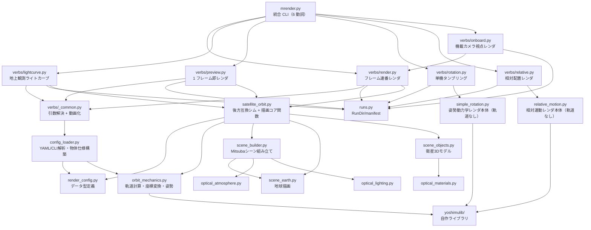

# 人工衛星軌道レンダリング（物理ベース）- 高度な光学シミュレータ

Mitsuba 3を使用して、ケプラー軌道要素に基づいた物理的に正確な人工衛星のレンダリングを行うプロジェクトです。

## 主な機能

✨ **新機能 - 高度な光学シミュレーション対応！**

### 基本機能

- **物理ベースの軌道計算**: ケプラー軌道要素を使用した正確な軌道位置・速度計算
- **実際の物理パラメータ**: 地球半径6371km、実際の軌道高度（ISS: 408km など）
- **姿勢制御システム**:
  - NADIR指向（地球中心を向く）
  - 太陽追尾（ソーラーパネルを太陽に向ける）
  - 速度整列（進行方向に整列）
- **リアルな衛星3Dモデル**: 本体、ソーラーパネル、アンテナを含む詳細なモデル
- **複数の視点モード**:
  - 慣性系俯瞰視点 inertial（衛星と地球を俯瞰）
  - 衛星搭載カメラ（地球を見下ろす）
- **物理ベースレンダリング**: Mitsuba 3によるフォトリアリスティックな照明

### 高度な光学機能 🔬

- **実際の宇宙材料**: アルミニウム、金メッキ、太陽電池、MLI断熱材など、実際の宇宙機材料の光学特性を再現
- **物理ベース太陽光**: 色温度（5778K）に基づいた正確な太陽光スペクトル
- **星空環境光**: リアルな宇宙背景（明るさ調整可能）
- **大気散乱モジュール**: レイリー散乱、ミー散乱による地球大気シミュレーション（実装済み）
- **地球アルベド効果**: 地球からの反射光（地球照）の計算（実装済み）

## セットアップ

### 配布版のセットアップ（学生・外部研究者向け）

GitHub の private repo を collaborator として招待された場合の手順。

```bash
git clone https://github.com/yyoshimula/mRendering.git
cd mRendering
python3 -m venv venv && source venv/bin/activate
pip install -r requirements.txt
python mrender.py gui                 # http://127.0.0.1:8600 が開く
```

- **Python 3.11 以上**が必要（開発は 3.11）。Mitsuba は pip で入る CPU 版
  （`llvm_ad_rgb`）で全機能が動く。Apple Silicon の Mac で動作確認済み。
- **`assets/starfield.exr`（287 MB）は clone に含まれない**。GitHub の
  100 MB 上限を超えるため Git 管理外で、初回起動時に `tools/generate_starfield.py`
  が HYG カタログから自動生成する（約 1 秒、毎回同じ内容）。
- **NASA Blue Marble の 500 m/px タイル**は任意。地球背景を高解像度にしたい
  場合だけ `python tools/prepare_bmng.py` で取得する（無くても既定テクスチャで動く）。
- **Blender は必須ではない**。Draco 圧縮 GLB を初めて読み込む時の変換にのみ使う。
- **AI ドロワー**（GUI ヘッダーの「🤖 AI」）は、ローカルに `claude` CLI が
  あれば自動で有効になる。無ければボタンが出ないだけ。
- **`gui_hosts.json`**（リモート実行マシンの定義）は Git 管理外。必要なら
  `cp gui_hosts.example.json gui_hosts.json` してから編集する。
- **`internal/` は研究室内限定のデータ**（共同研究由来のモデルと実観測検証）で、
  GitHub には含まれない。無くても全機能が動く。
- GPU（DGX Spark）で回したい研究室メンバーは [tools/dgx/README.md](tools/dgx/README.md) を参照。

### 1. 仮想環境の作成とアクティベート

```bash
python3 -m venv venv
source venv/bin/activate
```

### 2. 依存パッケージのインストール

```bash
pip install -r requirements.txt
```

## GUI（ブラウザ操作）

CLI を触らずにブラウザから全 verb を操作できます。Flask 等は不要（標準ライブラリのみ）。

```bash
source venv/bin/activate
python mrender.py gui                        # http://127.0.0.1:8600 が自動で開く
python mrender.py gui --port 8765 --no-browser   # ポート変更 / ブラウザ自動起動なし
```

### アプリとして起動（macOS、ダブルクリック）

```bash
bash packaging/build_app.sh    # → dist/mRender.app を生成（数百 KB の軽量ランチャー）
```

`dist/mRender.app` をダブルクリック（`/Applications` へコピーしても可）すると、
GUI サーバーをバックグラウンド起動して Chrome/Edge/Brave の app モード
（タブ無しのアプリ風ウィンドウ）で開きます。既にサーバーが動いていれば
ウィンドウを開くだけ（二重起動しない）。SatCap.app と違い Python は同梱せず
**このリポジトリの venv を使う**ので、リポジトリ移動後は再ビルドしてください。

- ログ: `runs/_gui_configs/gui_server.log`
- サーバー停止: `lsof -ti:8600 | xargs kill`
- アイコン再生成: `venv/bin/python packaging/make_icon.py`（衛星モデルをレンダして生成）

GUI でできること:

- **シナリオ → ターゲット → プリセット → 調整**: 上部の「絶対軌道・相対軌道・
  地上観測」を選び、ターゲットに対応するプリセットを選択すると自動で読み込む。
  タブを往復しても、そのページで編集中の値・開いていた設定欄を復元する。
  相対軌道ではchief・deputyを個別に選択し、chiefをHill原点 [0,0,0] kmに固定する。
  `relative_frame: hill`（既定）では相対位置はHill/RTN成分で、chiefの姿勢とは独立。
  旧形式のchief機体系の位置データには `relative_frame: chief` を指定する。
  カメラはchief→deputy、chief fixed、deputy→chief、deputy fixed、外部・手動を選べる。
  fixedは搭載機の姿勢に追従する固定視線で、追尾は相手機の中心を毎フレーム注視する。
  `camera_offset` / `camera_direction` / `camera_body_up` は搭載機の機体系で指定。
  機載カメラでは搭載側のモデルを非表示にする。
  「モデル確認」はブラウザ内でOBJ/PLY/GLB/glTFを直接表示する専用モード（Three.jsを同梱、CDN接続不要）。
  Mitsubaやリモートワーカーを使わず、モデル読込後のマウス操作・表示切替はブラウザ内だけで完結する。
  モデルを選ぶと全体が収まるように表示し、ドラッグで視点回転、ホイールで拡大縮小する。
  座標軸はモデル中心に置き、元モデルの軸方向を保つ。
  面表示・面＋ワイヤーフレーム・ワイヤーフレームのみを切り替えられる。
  材質はリアルタイム表示用の近似で、物理レンダリングとは異なる。
  「モデルの材質を使用」をONにすると、あかつき・Hubble・yKwnは登録プリセットの
  パーツ別材質を適用する（OFFでは形状確認用の一様なグレー）。
  ワイヤーは三角形メッシュの辺を表示し、「ワイヤーフレームのみ」では裏側の辺も見える。
  モデル確認ではDraco圧縮GLBも同梱デコーダで直接読み込む。通常のMitsubaレンダリング用の
  Draco圧縮GLBの初回変換にはBlenderが必要（PATH上、またはmacOSの標準インストール先から検出）。
  変換済みOBJは再利用し、全頂点が潰れた不正なOBJは元GLBから再生成する。従来の全 verb は「その他の実行モード」から選べる。
- **左で設定、右でライブプレビュー**: ライブプレビューは起動時 ON。
  視点と動画作成は上部で変更でき、軌道・材質・望遠鏡などの詳細設定は折りたたみ欄に残る。
  通常プリセットの選択は設定を置き換え、地球背景の差分プリセットは追加適用する。
- **プリセット保存**: GUI から保存した YAML はコメントにシナリオ・ターゲット情報を持ち、
  再起動後も同じ分類に表示される。分類のない独自 YAML は「カスタム」から読み込める。
- **レンダリング開始**（ジョブは
  `runs/_gui_configs/` に YAML を書き出してサブプロセス実行。進捗・最新フレーム・
  過去ラン一覧・動画リンクも GUI 上に表示）
- **YAML 表示 / プリセット保存**: フォーム内容をそのまま `presets/*.yaml` に保存
- **ライブプレビュー**（右カラムの「ライブプレビュー OFF」で停止可）: Blender の
  レンダープレビュー風ビューポート。フォーム変更で即再レンダ（~0.3 s）、
  アイドル時にフル解像度へ自動リファイン。
  - 左ドラッグ=オービット / ホイール=ドリー / Shift+ドラッグ=パン
    （結果は camera_origin/target 欄へ書き戻し）
  - タイムラインスライダーで tumble/csv の姿勢スクラブ、太陽方位/仰角スライダー
  - リファイン画像は本番出力とピクセル一致（render 系はビット一致）
  - 操作中は簡易描画（~0.1-0.2 s）に自動で切り替わり、手を離すと通常品質へ
- **実行マシン切替**（右上、AI ボタン横の「実行マシン」）: ジョブ・ライブプレビューを
  local / リモート GPU（例: dgx = DGX Spark）で実行。リモート定義は
  `gui_hosts.json`、結果は `runs/` へ自動ミラー。**事前に
  `tools/dgx/sync_to_dgx.sh` でコード・アセットの同期が必要**（モデルや
  プリセットを追加した後も再同期する）。詳細は [tools/dgx/README.md](tools/dgx/README.md)
- **AI アシスタント**（ヘッダーの「🤖 AI」）: ローカルの `claude` / `cursor-agent`
  CLI を中継するチャットドロワー。プリセット編集を頼むと GUI に自動反映される
- **地球背景の高解像度化（relative verb）**: 「宇宙環境」セクションで
  `earth_gibs` を ON にすると NASA GIBS の実写日次画像（雲込み、要ネット）を
  可視域だけ取得して背景にする。OFF でも既定で BMNG 500 m/px タイル
  （`assets/textures/earth_day_500m/`、無ければ `tools/prepare_bmng.py` で生成）
  から可視域クロップが効く

### 追加モデルライブラリ

モデル確認・chief・deputyのモデル一覧には、`models/library/` の追加モデルも表示されます。
ACS3、BlueWalker-3、EKRAN、H-IIA上段（ADRAS-J）を取り込み済みです。
非公開モデル（共同研究由来）は `internal/` に置き、研究室内でのみ配布します。
材質・テクスチャ・単位と再取り込み手順は [models/library/README.md](models/library/README.md) を参照。
生成OBJ・テクスチャはGit管理外のため、別マシンでは再生成またはアセット同期が必要です。

## 使用方法（CLI）

統合 CLI は `mrender.py` で、以下のサブコマンド（動詞）を提供します。
すべての設定は YAML プリセット（`--config`）で指定します。


| 動詞           | 用途                                                          | 主な出力                       |
| ------------ | ----------------------------------------------------------- | -------------------------- |
| `render`     | 軌道力学に基づくフレーム連番出力（動画用）                                       | `frames/frame_*.png`       |
| `lightcurve` | 主物体の地上観測ライトカーブを CSV 出力                                      | `light_curve.csv`          |
| `preview`    | 1 フレームだけ即レンダ（材質・ライティング調整用）                                  | `frames/frame_<start>.png` |
| `rotation`   | 軌道なし、単機のオイラー回転運動（タンブリング）                                    | `frames/frame_*.png`       |
| `relative`   | 軌道なし、相対位置・相対姿勢のみで 2 機を描画                                    | `frames/frame_*.png`       |
| `onboard`    | `render` の機載カメラ専用エイリアス（`view_mode=satellite` 既定、片方視点で別物体注視） | `frames/frame_*.png`       |
| `groundobs`  | 地上望遠鏡からの光学観測（見かけ等級ライトカーブ + 望遠鏡センサ像、TLE/SGP4 対応）              | `observation.csv`, `frames/` |
| `gui`        | 上記すべてを操作するブラウザ GUI（[GUI（ブラウザ操作）](#guiブラウザ操作) 参照）            | —                          |


```bash
source venv/bin/activate

# フル動画レンダリング
python mrender.py render --config presets/iss.yaml

# 観測者から見たライトカーブだけを高速計算
python mrender.py lightcurve --config presets/iss.yaml

# マテリアル・ライティング調整用に 1 枚だけ
python mrender.py preview --config presets/iss.yaml

# 複数プリセットの合成（後のファイルが優先）
python mrender.py render --config presets/iss.yaml presets/earth_beauty.yaml

# CSV ファイルから軌道・姿勢を読み込んでレンダリング
python mrender.py render --config presets/csv_attitude_orbit.yaml

# 単機のタンブリング（軌道なし、姿勢動力学のみ）
python mrender.py rotation --config presets/akatsuki.yaml
python mrender.py rotation --frames 30 --wx 0.3 --wy 0.1 --wz 1.5

# 2 機の相対配置（軌道なし、相対位置 + 相対姿勢）
python mrender.py relative --config presets/relative_static.yaml
python mrender.py relative --mode tumble --rel-position 1.5 0 0 --wz 1.0
python mrender.py relative --mode csv --rel-csv input/rel_state_sample.csv

# 軌道上の 2 機（CSV 駆動）— deputy 視点で chief を注視
python mrender.py onboard --config presets/relative_view.yaml

# 地上望遠鏡からの光学観測（等級ライトカーブ + センサ像。TLE も可）
python mrender.py groundobs --config presets/groundobs_hubble.yaml
```

### 代表ユースケース（CSV 入力で揃えて使い分け）


| ケース                      | 動詞                      | プリセット                          | 入力 CSV                                                 | 概要                                                                  |
| ------------------------ | ----------------------- | ------------------------------ | ------------------------------------------------------ | ------------------------------------------------------------------- |
| **A** 慣性系から軌道描画          | `render`                | `presets/csv_attitude_orbit.yaml` | `input/attitudeOrbit.csv`                              | 1 機の絶対軌道（osculating 6 要素＋姿勢任意）を読み込み、外部視点でレンダ                        |
| **B** 軌道上 2 機、片方視点で片方を見る | `onboard` (or `render`) | `presets/relative_view.yaml`   | `input/abs_chief_hcw.csv` + `input/abs_deputy_hcw.csv` | 2 機の絶対軌道を読み、`view_camera_name` / `view_target_name` で機載カメラ → 別物体を注視 |
| **C** 軌道なしの相対配置          | `relative`              | `presets/relative_static.yaml` | `input/rel_state_hcw.csv`                              | chief を原点固定し、deputy を相対位置・相対姿勢の時系列で配置（軌道力学なし）                       |


`presets/iss.yaml` は CSV 入力を使わず、ISS の軌道を慣性系の俯瞰視点で確認するためのサンプルプリセットです。`camera.view_mode: inertial`、軌跡線、慣性座標軸を有効にしているため、地球固定視点ではなく慣性空間内での軌道形状や衛星位置の変化を見る用途に向いています。

### 軌道なしモード（`rotation` / `relative`）

地球・軌道力学を使わず、姿勢/位置をユーザが直接与えてレンダする軽量モードです。
材質・ライティングの単独確認や相対運動デモに便利です。

- `rotation` — `simple_rotation.py` の処理を verb 化。慣性テンソルと初期角速度
を与え、オイラー回転運動方程式 `I·ω̇ = -ω×(I·ω)` で姿勢を伝播。
- `relative` — `relative_motion.py` の処理を verb 化。chief を原点・恒等姿勢に
固定し、deputy を相対位置 `r_rel` と相対姿勢クォータニオン `q_rel` で配置。3 つの入力
モード:
  - `static`: 単一の `(r_rel, q_rel)` を全フレームへ
  - `csv`: 時系列 CSV `time_s, x, y, z, qx, qy, qz, qw` を補間
  - `tumble`: chief 静止 + deputy をオイラー回転（位置固定、姿勢のみ動的）

サンプルプリセット: `presets/relative_static.yaml`, `presets/relative_tumble.yaml`。
サンプル CSV: `input/rel_state_sample.csv`。

`relative` はフォトリアル環境オプション（地球背景・太陽黒体色・星空 envmap・
機載カメラ視点）を持ち、OOS 近接撮像に向きます（例: `presets/oos_hubble.yaml`,
`presets/relative_ykwn_inspection.yaml`）。地球背景は既定で**可視域だけを
高解像度ソースから切り出して貼る**（BMNG 500 m/px タイル =
`assets/textures/earth_day_500m/`、無ければ `tools/prepare_bmng.py` で生成、
さらに `earth_gibs: true` で NASA GIBS の実写日次画像に切替可。要出典表記:
NASA GIBS）。詳細は CLAUDE.md の relative オプション節を参照。

### ラン単位の出力ディレクトリ

各実行は `runs/<YYYYMMDD_HHMMSS>_<verb>_<name>/` を新規生成し、以下を配置します：

```
runs/20260425_153000_render_iss/
├── frames/                 # フレーム画像（render / preview）
├── light_curve.csv         # ライトカーブ（lightcurve / 旧シム時）
├── config.resolved.yaml    # 解決済み引数のスナップショット（再現用）
└── manifest.json           # verb, argv, git rev, 開始/終了時刻, status, etc.
```

`output_dir` を YAML/CLI で明示指定した場合はそちらを使い、未指定なら自動で
`runs/...` を切ります。`runs/` は git 管理外（`.gitignore` 済み）。

### 後方互換: `satellite_orbit.py`

旧来のエントリポイントもそのまま動きます（内部で `mrender` の動詞へディスパッチ）：

```bash
# 旧形式 — 自動で render 動詞へ
python satellite_orbit.py --config presets/iss.yaml

# 旧形式 + ライトカーブ — frames + lightcurve を同じ run dir へ
python satellite_orbit.py --config presets/iss.yaml  # YAML 内で light_curve: true

# ライトカーブのみ（YAML で no_frames: true, light_curve: true）
python satellite_orbit.py --config presets/iss.yaml
```

挙動差は出力先のみ：旧 `output/` → 新 `runs/<ts>_render_<name>/frames/`。

### YAML プリセットの書き方

`presets/` ディレクトリ内のサンプルも参照してください。以下は `**render` / `lightcurve` / `preview` / `onboard` 系で使える全キーのリファレンス**です（軌道なしの `rotation` / `relative` verb は別系統 — 各 verb の `--help` 参照）。

セクション名（`primary`, `rendering`, `camera`, ...）は組織用で、内部キーがフラット化されて argparse dest 名に正規化されます。優先順位: **CLI 引数 > YAML > `_ARG_DEFAULTS`**。複数 YAML を `--config A.yaml B.yaml` で重ねた場合は **後の指定が勝ち**。

```yaml
# ===========================================================================
# primary: 主物体（衛星 1 機）の軌道・姿勢・モデル
# ===========================================================================
primary:
  name: iss                       # 物体名（シーン辞書の prefix にもなる）
  orbit:                          # primary.orbit.* はトップレベルへ展開される
    altitude: 408.0               #   高度 [km]（a = R_earth + altitude）
    eccentricity: 0.0             #   離心率 [-]
    inclination: 51.6             #   軌道傾斜角 [deg]
    raan: 0.0                     #   昇交点赤経 [deg]
    arg_periapsis: 0.0            #   近点引数 [deg]
    mean_anomaly: 0.0             #   平均近点角 [deg]（t=0 の初期位相）
  attitude_mode: nadir            # 'nadir' / 'sun_tracking' / 'velocity_aligned'
  scale: 0.002                    # シーン単位スケール（地球半径=1.0）
  model:                          # 外部 3D モデル（OBJ/PLY/GLB）
    path: null                    #   ファイルパス（null なら手続き的衛星）
    material: null                #   BSDF 名（'aluminum_brushed' / 'gold' / 'solar_panel' 等）
    keep_materials: false         #   true で OBJ の MTL をそのまま使う
  csv_path: null                  # 絶対軌道 CSV（指定で Kepler 伝播を上書き）
  propagator: kepler              # 'kepler'（解析解）/ 'numerical'（J2/drag）
  use_j2: false                   # numerical 時に J2 摂動を有効化
  use_drag: false                 # numerical 時に大気抵抗を有効化
  drag_cd: 2.2                    # 抵抗係数 Cd
  drag_a_over_m: 0.01             # 面積/質量比 [m²/kg]
  orbit_speed: 1.0                # 軌道進行倍率（1.0 で実時間相当）

# ===========================================================================
# objects: 追加物体（任意、複数指定可）。primary と同じスキーマ
# ===========================================================================
objects:
  - name: relay
    orbit:
      altitude: 600
      inclination: 97.8
    attitude_mode: sun_tracking
    scale: 0.002
    model_path: null              # path / material / keep_materials も可
    model_material: null
    csv_path: null                # 物体ごとに CSV 指定可（Case B）

# ===========================================================================
# rendering: 出力解像度・フレーム数・サンプリング・出力先・動画化
# ===========================================================================
rendering:
  frames: 60                      # 総フレーム数
  start_frame: 0                  # 部分レンダ開始（バッチ実行用）
  end_frame: null                 # 部分レンダ終端（null で frames まで）
  width: 1920                     # 画像幅 [px]
  height: 1080                    # 画像高さ [px]
  samples: 128                    # spp（パストレーシング 1 px 当たりサンプル数）
  output_dir: null                # 出力先。null で runs/<ts>_<verb>_<name>/ を自動生成
  no_frames: false                # true で frames 出力をスキップ（lightcurve だけ欲しい時）
  make_video: false               # 完了後に ffmpeg で mp4 を生成
  video_fps: 30.0                 # mp4 のフレームレート
  video_name: output.mp4          # mp4 ファイル名（run dir 直下）

# ===========================================================================
# animation: シミュレーション時刻のサンプリング
# ===========================================================================
animation:
  duration_sec: null              # シミュ総時間 [s]。null なら CSV 全長または軌道周期を frames に均等配分
  fps: null                       # duration_sec 指定時のみ使用。指定すると dt = 1/fps、未指定なら dt = duration_sec / frames
  start_time: 0.0                 # シミュ開始時刻 [s]（CSV 参照開始点）

# ===========================================================================
# camera: ビューモード・チェース距離・手動オーバーライド
# ===========================================================================
camera:
  view_mode: inertial             # 'inertial' / 'chase' / 'satellite' / 'earth'
  inertial_fixed: true            # inertial 時、慣性系で固定するか（false で物体を追従）
  inertial_distance: 2.5          # inertial 時、地心距離（シーン単位）
  chase_back: 0.15                # chase 時、後方オフセット（シーン単位）
  chase_out: 0.1                  # chase 時、法線方向オフセット（シーン単位）
  origin: null                    # 手動カメラ位置 [x,y,z]（シーン単位）
  target: null                    # 手動注視点 [x,y,z]（シーン単位）
  fov: null                       # 視野角 [deg]
  up: null                        # 上方向ベクトル [x,y,z]
  target_lat: null                # 注視点緯度 [deg]
  target_lon: null                # 注視点経度 [deg]
  target_alt: 0.0                 # 注視点高度 [km]
  view_camera_name: null          # satellite ビュー時、カメラ役物体の name
  view_target_name: null          # satellite ビュー時、注視対象物体の name

# ===========================================================================
# earth: 地球テクスチャ・雲・夜光・大気・自転
# ===========================================================================
earth:
  day_texture: assets/textures/earth_day.jpg  # 昼側テクスチャ（equirectangular 推奨）
  night_texture: null             # 夜光テクスチャ（例: BlackMarble）
  cloud_texture: null             # 雲テクスチャ
  use_night_lights: false         # 夜光レイヤーを描画
  use_clouds: false               # 雲レイヤーを描画
  cloud_opacity: 0.5              # 雲の不透明度 [0..1]
  night_mask_res: 1024            # 夜マスク解像度 [px]
  night_terminator_softness: 0.02 # 昼夜境界の smoothstep 幅
  use_atmosphere: false           # 大気シェルを追加
  atmosphere_density: 0.02        # 大気散乱係数スケール
  atmosphere_radius_scale: 1.03   # 大気層の半径（1.0 が地表）
  earth_only: false               # true で地球のみ（衛星等を非表示）
  earth_rotation: true            # 地球自転を有効化
  earth_rotation_period_hours: 23.934  # 自転周期 [h]（恒星日）
  earth_rotation_speed: 1.0       # 自転速度倍率（デバッグ用）

# ===========================================================================
# lighting: 太陽・星空・HDRI・軌跡線・トーンマップ
# ===========================================================================
lighting:
  advanced_optics: false          # 黒体放射太陽 + starfield envmap を使う
  sun_temperature: 5778.0         # 太陽の有効温度 [K]
  sun_angle: null                 # 太陽方向の手動指定 [deg]、null で自動
  sun_rotate: false               # 時間で太陽方向を回転
  sun_rotate_period: 60.0         # 太陽回転の周期 [s]
  sun_rotate_speed: 1.0           # 太陽回転速度倍率
  starfield_brightness: 0.01      # 星空 envmap の倍率
  hdri_path: null                 # HDRI 環境マップ画像パス（null なら星空 or 暗黒）
  show_orbit: false               # 軌跡（trajectory）線を描く（render verb のみ対応）
  orbit_line_radius: 0.005        # 軌跡シリンダー半径（シーン単位）
  orbit_line_color: [0.2, 0.6, 1.0]  # 軌跡 RGB 色 [0..1]
  orbit_line_glow: 0.5            # 軌跡の自発光倍率（0 で非発光）
  exposure: 0.0                   # 露光補正 [stops]（+1 で 2 倍明るくなる）
  gamma: 2.2                      # ガンマ補正値（sRGB 近似）

# ===========================================================================
# observer: ライトカーブ用の地上観測点（lightcurve verb / light_curve=true 時）
# ===========================================================================
observer:
  light_curve: false              # ライトカーブ CSV を出力する
  light_curve_fov: 2.0            # 観測者の視野角 [deg]
  light_curve_samples: 64         # ライトカーブ 1 サンプル当たり spp
  observer_lat: 35.0              # 観測者緯度 [deg]
  observer_lon: 135.0             # 観測者経度 [deg]
  observer_alt: 0.0               # 観測者高度 [km]
```

**補足**:

- すべてのキーとデフォルト値は `[config_loader.py](config_loader.py)` の `_ARG_DEFAULTS`（行 188〜）が単一の正です。新規キーを足す場合もここに加える
- セクション名は組織用で、`primary` / `camera` / `earth` のみ専用 merge 関数で再マッピング（例: `camera.fov` → `camera_fov`、`primary.model.path` → `satellite_model`）。それ以外（`rendering`, `lighting`, `animation`, `observer`）は単純なフラット化なので、内部キー名は `_ARG_DEFAULTS` の dest 名と一致させること
- `rotation` / `relative` verb は **このリファレンスとは別の引数体系**（各 verb の `simple_rotation.py` / `relative_motion.py` の argparse 定義参照、または `presets/akatsuki.yaml` / `presets/relative_full.yaml` を雛形にする）

## 出力

各実行は新規ランディレクトリを生成します（[ラン単位の出力ディレクトリ](#ラン単位の出力ディレクトリ) 参照）：

```
runs/20260425_153000_render_iss/
  ├── frames/
  │   ├── frame_0000.png
  │   ├── frame_0001.png
  │   └── ...
  ├── light_curve.csv          # lightcurve 動詞 / --light-curve 時のみ
  ├── config.resolved.yaml
  └── manifest.json
```

`manifest.json` には `verb`, `argv`, 解決済み引数, git rev, 開始/終了時刻, status が
記録されるため、過去のランを後から完全に再現できます。

## シーンの構成

### 地球モデル

- 半径: 6371 km（実際の地球半径）
- マテリアル: Diffuse（拡散反射）
- テクスチャ: オプションで画像マッピング可能
- 追加レイヤー（オプション）:
  - 夜間光（夜側マスク適用済みの発光）
  - 雲レイヤー（薄い白の拡散反射）
  - 簡易大気シェル（薄い散乱媒体）

### 衛星モデル（詳細な3Dモデル）

- **本体**: アルミニウム製の箱型（1.5×1.5×2.0m相当）
- **ソーラーパネル**: 両翼に配置（5×3m相当）、濃紺色
- **アンテナ**: 金メッキの円筒形

### 照明

- **太陽光**: 時刻に応じて位置が変化する指向性光源
- **環境光**: 暗い宇宙背景（星空）

## アニメーション動画の作成

### 自動（推奨）

YAML / CLI で `make_video: true` を指定すれば、`render` / `relative` / `onboard` がレンダ完了後に
`runs/<ts>_<verb>_<name>/output.mp4` を自動生成します（要 ffmpeg）。

```yaml
rendering:
  frames: 60
  make_video: true       # ffmpeg 不在なら警告のみ出してスキップ
  video_fps: 30          # mp4 の再生フレームレート。シミュレーション時刻の刻みとは独立
  video_name: output.mp4 # 出力ファイル名（run dir 直下）
```

### 手動

画像シーケンスから個別に作成（ffmpeg が必要）：

```bash
RUN=runs/20260425_153000_render_iss   # 対象ランを指定

# 30fps
ffmpeg -framerate 30 -i $RUN/frames/frame_%04d.png \
    -c:v libx264 -pix_fmt yuv420p $RUN/satellite_orbit.mp4

# 60fps（滑らか）
ffmpeg -framerate 60 -i $RUN/frames/frame_%04d.png \
    -c:v libx264 -pix_fmt yuv420p -crf 18 $RUN/satellite_orbit_hq.mp4
```

## カスタマイズ

各モジュールの編集により以下をカスタマイズ可能：

- 衛星の形状・サイズ（`scene_objects.py` の `create_satellite`関数）
- 地球のマテリアル（`scene_earth.py` の `create_earth`関数）
- レンダリング品質（`satellite_orbit.py` の `sample_count`）
- カメラ視野角・位置（`scene_builder.py` の `create_scene`関数）

## トラブルシューティング

### レンダリングが遅い場合

YAML の `rendering.samples` を下げる、もしくはまず `preview` で 1 枚だけ確認する：

```bash
python mrender.py preview --config presets/iss.yaml
```

### 高解像度レンダリング

YAML で解像度を指定（推奨）：

```yaml
rendering:
  width: 3840
  height: 2160
  frames: 30
  samples: 128
```

### バッチレンダリング

`start_frame` / `end_frame` を YAML で指定して分割実行できます。
`output_dir` を同じパスに固定すれば、複数バッチを 1 つのランへ束ねられます：

```yaml
# presets/_batch_a.yaml
rendering:
  frames: 100
  start_frame: 0
  end_frame: 25
output_dir: runs/iss_long_run     # 明示指定で同一 run dir に集約
```

## 技術詳細

### 軌道力学

- **軌道計算**: ケプラー方程式の数値解法（ニュートン法）
- **座標系**: ECI（地球中心慣性座標系）
- **軌道要素**: 完全な6要素対応（a, e, i, Ω, ω, M₀）
- **軌道周期**: ケプラーの第三法則により自動計算

### 姿勢制御

- **NADIR指向**: Z軸が常に地球中心を向く
- **太陽追尾**: Z軸が太陽方向を追尾
- **速度整列**: X軸が速度方向に整列

### レンダリング

- **エンジン**: Mitsuba 3
- **バリアント**: scalar_rgb（CPUベース）
- **手法**: パストレーシング
- **サンプル数**: 128 spp（高品質）
- **最大深度**: 12バウンス

### 光学シミュレーション

#### 材質モデル（optical_materials.py）

- **導体材料**: アルミニウム、金、銀、銅、チタン（複素屈折率ベース）
- **誘電体材料**: ガラス、サファイア、カプトン、テフロン
- **宇宙機材料**:
  - 衛星本体: ブラシ仕上げアルミニウム（異方性反射）
  - 太陽電池: 低反射率拡散面（青みがかった暗色）
  - アンテナ: 金メッキ（低粗さ導体）
  - MLI断熱材: 金色薄膜（鏡面反射と拡散反射の混合）
- **BSDF**: conductor, roughconductor, dielectric, roughdielectric, plastic, diffuse

#### 照明モデル（optical_lighting.py）

- **太陽光**: 黒体放射理論に基づく色温度→RGB変換（5778K = 昼光）
- **等級システム**: 天体の視等級から相対強度を計算
- **環境光**: 星空、地球照のモデル化
- **照明プリセット**: 昼光、夕焼け、日食など

#### 大気散乱（optical_atmosphere.py）

- **レイリー散乱**: λ^(-4)の波長依存性、青空や夕焼けの再現
- **ミー散乱**: エアロゾル散乱、Henyey-Greenstein位相関数
- **大気モデル**: 指数関数的密度減衰（スケールハイト: 8km）
- **光学的厚さ**: 経路積分による減衰計算
- **地球アルベド**: 地球からの反射光（地球照）の立体角計算

## モジュール構成




```
mRendering/
├── mrender.py                  # 統合 CLI（render / lightcurve / preview / rotation / relative / onboard）
├── runs.py                     # RunDir + manifest 管理
├── verbs/                      # サブコマンド本体
│   ├── _common.py              #   引数解決・物体仕様構築・動画化（maybe_make_video）共通処理
│   ├── render.py               #   フレーム連番レンダ（軌道あり）
│   ├── lightcurve.py           #   地上観測ライトカーブ
│   ├── preview.py              #   1 フレーム即レンダ
│   ├── rotation.py             #   単機タンブリング（軌道なし）
│   ├── relative.py             #   2 機の相対配置（軌道なし）
│   └── onboard.py              #   機載カメラ視点で別物体を注視（render の薄いエイリアス）
├── satellite_orbit.py          # render/lightcurve/preview のコア（render_frame など）+ 後方互換シム
├── simple_rotation.py          # rotation のコア（軌道なし、オイラー回転運動方程式）
├── relative_motion.py          # relative のコア（軌道なし、相対位置・相対姿勢）
├── config_loader.py            # YAML/CLI解析、argparse定義、物体仕様構築
├── render_config.py            # 設定データ型（dataclass）と定数
├── orbit_mechanics.py          # 軌道計算・座標変換・幾何判定（CsvEphemeris 含む）
├── scene_objects.py            # 衛星3Dモデル生成、外部モデル読み込み
├── scene_earth.py              # 地球描画（テクスチャ、雲、夜光、大気）
├── scene_builder.py            # Mitsubaシーン辞書組み立て、カメラ、トーンマップ
├── optical_atmosphere.py       # 大気散乱モジュール
├── optical_materials.py        # 光学材質ライブラリ
├── optical_lighting.py         # 照明・環境光モジュール
├── presets/                    # YAMLプリセット
│   ├── iss.yaml                #   ISS基本軌道
│   ├── football.yaml           #   複数物体デモ
│   ├── multi_object.yaml       #   複数物体サンプル
│   ├── earth_beauty.yaml       #   地球ビューティショット
│   ├── csv_attitude_orbit.yaml #   CSV ephemeris から軌道・姿勢を読み込み（Case A）
│   ├── akatsuki.yaml           #   あかつきタンブリング（rotation 用）
│   ├── relative_static.yaml    #   相対 CSV 静止/再生（Case C, relative csv モード）
│   ├── relative_tumble.yaml    #   chief 静止 + deputy タンブリング（relative tumble）
│   ├── relative_full.yaml      #   relative の全項目リファレンス
│   └── relative_view.yaml      #   軌道上 2 機 — deputy 視点で chief 注視（Case B, onboard 用）
├── input/                      # 外部入力データ（CSV ephemeris 等）
│   ├── attitudeOrbit.csv       #   絶対軌道 CSV サンプル（Case A）
│   ├── abs_chief_hcw.csv       #   絶対軌道 CSV: GEO chief（Case B）
│   ├── abs_deputy_hcw.csv      #   絶対軌道 CSV: chief に対する deputy（Case B）
│   └── rel_state_hcw.csv       #   相対状態 CSV サンプル（Case C, HCW frame）
├── runs/                       # 実行成果物（git 管理外）
├── yoshimulib/                 # 自作ライブラリ（軌道力学、姿勢、座標変換等）
├── earth_texture.jpg           # 地球テクスチャ（デフォルト）
├── requirements.txt            # Python依存関係
└── README.md                   # このファイル
```

### 複数物体

複数物体は CLI ではなく YAML の `objects:` 配列で指定します。各要素で `name`, `orbit`, `attitude_mode`, `scale`, `model_path`, `csv_path` などを設定できます。

### CSV から軌道・姿勢を読み込む

CSV 入力スキーマは 2 種類あります（範囲外の `t` は端点クランプ＋初回 stderr 警告）。


| 用途                         | 列                                                                       | 座標系                                                                                     | 読み込み元                                                                | 例ファイル                                                                            |
| -------------------------- | ----------------------------------------------------------------------- | --------------------------------------------------------------------------------------- | -------------------------------------------------------------------- | -------------------------------------------------------------------------------- |
| 絶対軌道（osculating Keplerian） | `time_s, a_km, e, inc_rad, raan_rad, ome_rad, f_rad [, q1, q2, q3, q4]` | ECI（位置/速度）+ ECI→Body クォータニオン                                                            | `CsvEphemeris` ([orbit_mechanics.py](orbit_mechanics.py))            | `input/attitudeOrbit.csv`, `input/abs_chief_hcw.csv`, `input/abs_deputy_hcw.csv` |
| 相対状態（位置 + クォータニオン）         | `time_s, x, y, z, qx, qy, qz, qw`                                       | **位置: chief の RTN（LVLH）座標系で表した deputy の相対位置** / 姿勢: chief Body → deputy Body の相対クォータニオン | `load_csv_relative_state` ([relative_motion.py](relative_motion.py)) | `input/rel_state_hcw.csv`                                                        |


- 角度はラジアン、距離は km、姿勢クォータニオンはスカラーラスト（`qx, qy, qz, qw`）
- **相対状態 CSV の `(x, y, z)` は chief の RTN 基底（R: radial, T: transverse=along-track, N: normal=cross-track）で表した deputy の位置**。HCW 方程式の出力をそのまま流せる前提（例: `matlabSample/mainHCW.m` → `input/rel_state_hcw.csv`）
- `relative` verb は chief を原点・恒等姿勢にピン留めし、deputy をこの相対位置・相対姿勢で配置する（軌道力学なし、シーン単位として扱う）
- クォータニオンは読み込み時に自動正規化、ゼロベクトルはエラー
- `primary.csv_path` または `objects[].csv_path` で絶対軌道 CSV を指定すると、ケプラー伝播の代わりにファイルから状態を補間
- 姿勢列があれば自動で姿勢に反映、なければ `attitude_mode`（nadir / sun_tracking / velocity_aligned）の規則を適用
- `#` で始まる行と数値化に失敗するヘッダ行は自動スキップ
- 相対状態 CSV は `relative_motion.py`（`relative` verb）の `mode: csv` で消費

サンプルプリセット: `presets/csv_attitude_orbit.yaml`（A）, `presets/relative_view.yaml`（B）, `presets/relative_static.yaml`（C）。

### 時間軸の制御（`start_time` / `duration_sec`）

CSV の特定区間だけをレンダする、長時間 ephemeris を N フレームに均等配分する場合に使います。

```yaml
rendering:
  frames: 60
  start_time: 600.0      # シミュ開始時刻 [s]（CSV のここから読む）
  duration_sec: 86160    # 総時間 [s]。指定すると dt = duration_sec / frames
```

`render` / `onboard` では `duration_sec` 未指定時、`fps` はシミュレーション時刻に影響しません。
CSV 入力なら CSV の全時間範囲、Kepler 伝播なら軌道周期を `frames` 枚に均等配分します。
`duration_sec` と `fps` を両方指定した場合は `dt = 1/fps` で時刻を進めます。
mp4 の再生速度は `rendering.video_fps` で別に指定します。

`relative` / `rotation` は専用 CLI 側で `fps` を `dt = 1/fps` として使います。

実時間再生にしたい場合は、シミュレーション時間と動画の再生時間を一致させます。

```text
動画の長さ [s] = frames / video_fps
再生倍率       = duration_sec / (frames / video_fps)
実時間再生     = duration_sec == frames / video_fps
```

例: 3600 秒の CSV を 1 fps で実時間再生する場合:

```yaml
rendering:
  frames: 3600
  make_video: true
  video_fps: 1

animation:
  duration_sec: 3600
```

例: 3600 秒の CSV を 60 秒動画として 60 倍速で見る場合:

```yaml
rendering:
  frames: 1800
  make_video: true
  video_fps: 30

animation:
  duration_sec: 3600
```

### 機載カメラで別物体を注視（Case B）

`view_mode: satellite` のとき、`view_camera_name` と `view_target_name` で物体名を指定すると、
カメラ役の物体を画面から非表示にしつつ、注視対象を毎フレーム動的に追跡します。
カメラ up は視線とほぼ平行なら世界 Z にフォールバックし、Gram-Schmidt で直交化します（ロール暴れ抑制）。

```yaml
camera:
  view_mode: satellite
  view_camera_name: deputy   # この物体をカメラ位置・姿勢に
  view_target_name: chief    # この物体を毎フレーム注視（位置を動的取得）
  fov: 30.0
```
